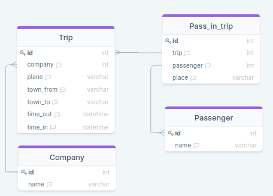
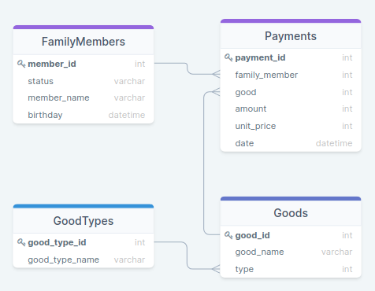
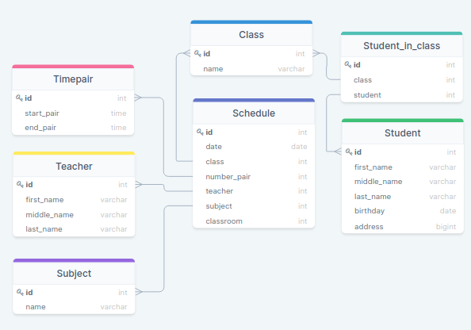

Решение заданий
---
---
**Таблица: Путешествия**



**Таблица: Семейные покупки**



**Таблица: Школа**



---

№ 1
---

**Задача:** 

Вывести имена всех когда-либо обслуживаемых пассажиров авиакомпаний

**Условие:**

Поля в результирующей таблице: name

**Решение:**
```sql
SELECT name from Passenger;
```
---


№ 2
---

**Задача:** 

Вывести названия всеx авиакомпаний

**Условие:**

Поля в результирующей таблице: name

**Решение:**
```sql
SELECT name FROM Company;
```
---


№ 3
---

**Задача:**

Вывести все рейсы, совершенные из Москвы

**Условие:**

Поля в результирующей таблице: *

**Решение:**
```sql
SELECT * FROM Trip 
WHERE town_from = 'Moscow';
```
---


№ 4
---

**Задача:**

Вывести имена людей, которые заканчиваются на "man"

**Условие:**

Поля в результирующей таблице: name

**Решение:**
```sql
SELECT name FROM Passenger 
WHERE name LIKE ('%man');
```
Функция LIKE сверяет по паттерну, как регулярное выражение,
спец.символ '%' указывает на любое количество символов. 

---


№ 5
---

**Задача:**

Вывести количество рейсов, совершенных на TU-134

**Условие:**

Поля в результирующей таблице: count

**Решение:**

```sql
SELECT COUNT(*) as count  
FROM Trip 
WHERE plane = 'TU-134';  
```
Отсеиваем условием WHERE на нужный тип самолетов, и 
далее просто считаем количество этих самолетов.

---


№ 6
---

**Задача:**

Какие компании совершали перелеты на Boeing

**Условие:**

Поля в результирующей таблице: name

**Решение:**

```sql
SELECT DISTINCT 
                cm.name
FROM Company AS cm 
INNER JOIN Trip AS tr ON cm.id = tr.company
WHERE 
      tr.plane = "Boeing"
```
Есть 2 таблицы, с компаниями и путешествиями, соединяем их по
внешнему ключу, получаем те компании из таблицы компании, у
которых в другой таблице тип самолета это "Boeing"

---


№ 7
---

**Задача:**

Вывести все названия самолётов, на которых можно улететь в Москву (Moscow)

**Условие:**

Поля в результирующей таблице: plane

**Решение:**

```sql
SELECT DISTINCT  
                plane 
FROM Trip AS tr 
WHERE town_to = 'Moscow'
```
---


№ 8
---

**Задача:**
В какие города можно прилететь из Парижа и сколько времени это займет?

**Условие:**

Вывести в формате HH:MM:SS

**Решение:**

Данные изымаются из одной таблицы, условие отбора в разделе `WHERE`
это город Париж, что есть в самой таблице, единственная интересная часть
запроса это разница между 2 датами, которая должна быть выведена в 
формате времени.

Имеем 2 даты :
`1900-01-01T14:30:00.000Z`	`1900-01-01T17:50:00.000Z`

Для нахождения разницы в формате даты/времени часто используются 2 функции,
`DATEDIFF` и `TIMEDIFF`, эти функции находят разницу ежду датами и временем.
Используем `TIMEDIFF` и находим разницу во времени

```sql
SELECT 
    tr.town_to, 
    TIMEDIFF(tr.time_in, tr.time_out) AS flight_time 
FROM 
    Trip AS tr 
WHERE 
    tr.town_to = 'Paris'
;
```

Ответ:

| town_to       | flight_time        |
| ------------- |:------------------:|
| Paris     | 03:20:00    |
| Paris     | 01:00:00 |

---


№ 9
---

**Задача:**

Какие компании организуют перелеты с Владивостока (Vladivostok)?

**Условие:**

Поля в результирующей таблице: name

**Решение:**

```sql
SELECT DISTINCT cm.name 
FROM Company AS cm INNER JOIN Trip AS tr 
ON cm.id = tr.company
WHERE town_from = 'Vladivostok';
```
---


№ 10
---

**Задача:**

Вывести вылеты, совершенные с 10 ч. по 14 ч. 1 января 1900 г.

**Условие:**

Поля в результирующей таблице: *

**Решение:**

Используем оператор `BETWEEN` для поиска в промежутке.

```sql
SELECT * 
FROM Trip as tr
WHERE time_out BETWEEN "1900-01-01T10:00:00.000Z" AND "1900-01-01T14:00:00.000Z"
;
```
---


№ 11
---

**Задача:**

Вывести пассажиров с самым длинным именем

**Условие:**

Поля в результирующей таблице: name

**Решение:**

Используя специальную функцию `LENGTH()` мы можем подсчитать количество элементов в 
строке, запросом типа `LENGTH(name)` мы получим количество всех символов в строке.

Одним под запросом выбираем все что есть в таблице, включая дополнительное поле 
`char_counter` в котором будет количество всех символом в имени пассажира, другим
под запросом просто находим максимальное количество символов в строках что всего есть 
в таблице.

Соединим эти 2 запроса, и выберем все строчки в которых количество символов 
равняется максимальному.

```sql
SELECT 
       name
FROM 
    ( 
        SELECT *, LENGTH(name) AS char_counter
        FROM Passenger
    ) AS ps
WHERE 
      ps.char_counter = ( SELECT MAX(LENGTH(name)) FROM Passenger )
;
```

Этот запрос хорош тем, что если есть несколько строк с максимальной длинной, то 
будут выбраны все они.

В случае если нам требуется просто выбрать одно любое, имя с максимальным количеством
символов, то можно использовать другой запрос, такого типа: 

```sql
SELECT 
       name
FROM 
     Passenger AS ps
ORDER BY LENGTH(name) DESC LIMIT 1
;
```

Мы можем сортировать не только по строке, но и по количеству символов в строке,
используем обратную `DESC` сортировку чтобы первыми шли большие по количеству символов
строки, а после при помощи `LIMIT` мы выводим только первую строку, этот метод 
короче, но если есть несколько строк с максимальным количеством символов, то мы 
их пропустим, ибо выводим только первую строчку.

---


№ 12
---

**Задача:**

Вывести id и количество пассажиров для всех прошедших полётов

**Условие:**

Поля в результирующей таблице: trip, count

**Решение:**

```sql
SELECT 
    pit.trip as trip, count(pr.id) as count
FROM 
    Pass_in_trip AS pit INNER JOIN Passenger AS pr ON pit.passenger = pr.id
GROUP BY 
    trip
;
```
Это типичный, стандартный пример обычной группировки, есть 2 таблицы связанные
по внешнему ключу, одна путешествий и другая с пассажирами, что на эти 
путешествия зарегистрированы, соединяем таблицы, группируем по путешествиям,
и к каждому из путешествий используем агрегатную функцию count, чтобы
посчитать количество пассажиров, зарегистрированных для каждого из путешествий.

---

№ 13
---

**Задача:**
Вывести всех пассажиров у которых есть полные тески

**Решение:**
Группируем по именам пассажиров, таким образом остаются только группы,
далее используем `HAVING` для фильтрации по количеству записей в 
каждой из групп, если записей в группе более чем 1 то.

```sql
SELECT 
    name
FROM
    Passenger
GROUP BY 
    name
HAVING 
    count(name) > 1
;
```
---

№ 14
---

**Задача:**

В какие города летал Bruce Willis

**Условие:**

Поля в результирующей таблице: town_to

**Решение 1:**

```sql
SELECT DISTINCT 
    tr.town_to
FROM 
    Trip AS tr 
    INNER JOIN Pass_in_trip AS pit ON tr.id = pit.trip 
    INNER JOIN Passenger AS pa ON  pit.passenger = pa.id 
WHERE 
    pa.name = 'Bruce Willis';
```
Из-за того что имена пассажиров лежат в одной таблице, а города 
для полета в другой, и связаны между собой они через связующую таблицу,
нам приходится делать 2 связки, чтобы соединить 3 таблицы.

**Решение 2:**

```sql
SELECT town_to 
FROM Trip 
WHERE id IN(
    SELECT trip 
    FROM  Pass_in_trip 
    WHERE Passenger IN(
        SELECT id 
        FROM Passenger 
        WHERE name = 'Bruce Willis'
    ) 
) 
```
Это второй способ решения данной задачи, она основана на 2 
под запросах, суть ее решение следующая.

Первый запрос:
```sql
SELECT id from Passenger WHERE name = 'Bruce Willis'
-- Получаем
--        1 
--       31
``` 

Второй запрос:
```sql
SELECT * FROM  Pass_in_trip 
WHERE Passenger IN(1,31) 
-- Получаем
-- 1	1100	1	1a
-- 3	1123	1	4c
-- 7	1181	1	1a
```

Внешний запрос:
```sql
SELECT * FROM Trip 
WHERE id IN(1100, 1123, 1181) 
-- Получаем
-- 1100	 4	Boeing	Rostov	Paris	   
-- 1123	 3	TU-154	Rostov	Vladivostok
-- 1181	 1	TU-134	Rostov	Moscow
```
---

№ 15
---

**Задача:**

Во сколько Стив Мартин (Steve Martin) прилетел в Лондон (London)

**Условие:**

Поля в результирующей таблице: time_in

**Решение:**

Это типичный пример обыкновенного джоина.
```sql
SELECT 
       time_in 
FROM 
     Trip as tr
INNER JOIN Pass_in_trip AS pit ON tr.id = pit.trip
INNER JOIN Passenger AS pa ON pit.passenger = pa.id
WHERE 
      pa.name = "Steve Martin" AND tr.town_to = "London";
```
---


№ 18
---

**Задача:**

Узнать, кто старше всех в семьe

**Условие:**

Поля в результирующей таблице: member_name

**Решение:**

Первый способ, это отсортировать по полю возраста и вывести первую строку, так проще,
но в случае если есть несколько людей, с одинаковым днем рождения, то мы получим
только первого из них.

```sql
SELECT member_name
FROM FamilyMembers AS fm 
ORDER BY birthday 
LIMIT 1;
```

Другой способ вернет всех людей с самым большим возрастом, в любом количестве, но 
он требует под запроса, под запрос получаем самый старый день рождения, после чего 
мы изымаем из таблицы все записи, в которых поле дня рождения равняется уже полученному
самому максимальному дню рождения.

```sql
SELECT member_name
FROM FamilyMembers
WHERE birthday = (SELECT MIN(birthday)
FROM FamilyMembers)
```

---


№ 19
---

**Задача:**

Определить, кто из членов семьи покупал картошку (potato)

**Условие:**

Поля в результирующей таблице: status

**Решение:**

Это типичный пример обыкновенного, просто связываем таблицы и отсеиваем
на предмет товара "Картошка".
```sql
SELECT DISTINCT 
                fm.status
FROM 
     FamilyMembers AS fm 
INNER JOIN Payments AS pay ON fm.member_id = pay.family_member
INNER JOIN Goods AS go ON pay.good = go.good_id
WHERE 
    go.good_name = "potato";
```
---

№ 22
---

**Задача:**

Найти имена всех матерей (mother)

**Условие:**

Поля в результирующей таблице: member_name

**Решение:**

```sql
SELECT 
       member_name
FROM 
     FamilyMembers AS fm 
WHERE 
      status = "mother";
```
---

№ 23
---

**Задача:**
Вывести самый дорогой продукт 

**Условие:**
Вывести поля `good_name`,`unit_price`

**Решение:**
Один под запрос получает товар с максимальной ценой, далее мы просто 
получаем товар у которого цена такая же как и у товара, что был получен 
под запросом.

```sql
SELECT goo.good_name , pay.unit_price 
FROM
    Goods AS goo INNER JOIN 
    Payments AS pay ON goo.good_id = pay.good
WHERE 
    pay.unit_price = (select max(unit_price) from Payments)
;

```
---


№ 28
---

**Задача:**

Сколько рейсов совершили авиакомпании с Ростова 
(Rostov) в Москву (Moscow) ?

**Условие:**

Поля в результирующей таблице: count(*)

**Решение:**

```sql
SELECT count(*) AS count
FROM 
    Trip AS tr 
WHERE 
    town_from = "Rostov" AND town_to = "Moscow";
```
---


№ 31
---

**Задача:**
Вывести всех членов семьи у которых фамилия заканчивается на Quincey


**Условие:**


**Решение:**

```sql
SELECT * 
FROM FamilyMembers 
WHERE member_name LIKE('%Quincey%')
;
```
---

№ 34
---

**Задача:**

Сколько всего 10-ых классов

**Условие:**

Поля в результирующей таблице: count

**Решение:**

```sql
SELECT count(name) as count 
FROM class 
WHERE name LIKE("10%")
;
```
---

№ 36
---

**Задача:**

Выведите информацию об обучающихся живущих на улице 
Пушкина (ul. Pushkina)?

**Условие:**

Поля в результирующей таблице: *

**Решение:**

```sql
SELECT *
FROM Student
WHERE address LIKE("%ul. Pushkina%");
```
---

№ 38
---

**Задача:**

Сколько Анн (Anna) учится в школе ?

**Условие:**

Поля в результирующей таблице: count

**Решение:**

```sql
SELECT count(*) as count 
FROM Student
WHERE first_name = "Anna";
```
---


№ 39
---

**Задача:**

Сколько обучающихся в 10 B классе ?

**Условие:**

Поля в результирующей таблице: count

**Решение:**

```sql
SELECT 
       count(*) as count 
FROM 
    Student_in_class AS sic 
    INNER JOIN Class AS cs ON sic.class = cs.id 
WHERE 
    cs.name LIKE("10 B");
```
---


№ 41
---

**Задача:**

Во сколько начинается 4-ый учебный предмет по расписанию ?

**Условие:**

Поля в результирующей таблице: start_pair

**Решение:**

```sql
SELECT start_pair
FROM Timepair as tm
WHERE id = 4
```
---


№ 46
---

**Задача:**

В каких классах введет занятия преподаватель "Krauze" ?

**Условие:**

Поля в результирующей таблице: name

**Решение:**

```sql
SELECT DISTINCT cl.name  
FROM Schedule AS sc 
INNER JOIN Teacher AS tc ON sc.teacher = tc.id 
INNER JOIN Class AS cl ON sc.class = cl.id 
WHERE tc.last_name = "Krauze";
```
---


№ 53
---

**Задача:**

Измените имя «Andie Quincey» на новое «Andie Anthony».

**Решение:**

Команда `UPDATE` позволяет изменять значение в записях, не добавлять 
как это происходит командой `INSERT` а поменять уже существующую, в 
части `WHERE` можно указывать условие, какие именно записи должны быть 
изменены. 

```sql
UPDATE FamilyMembers SET member_name = "Andie Anthony"
WHERE member_name = "Andie Quincey";
```
---

№ 49
---

**Задача:**

Какой процент учащихся учится в классе «10 А»?

**Условие:**

В ответе должно быть поле `percent` 

**Решение №1:**

Делаем 2 под запроса, один получает количество учащихся в `10A`, второй
общее количество учеников, далее считаем из них процент, решение простое
и не эффективное.
```sql
-- Число 7 указывает id записи в таблице Class, 
-- это справочник что содержит запись "10A"
SELECT 
    (SELECT COUNT(*) FROM Student_in_class WHERE class = 7) * 100 / 
    (SELECT COUNT(*) FROM Student_in_class) 
AS percent 
;
```

**Решение №2:**


---


№ ?
---

**Задача:**


**Условие:**


**Решение:**

```sql

```
---
