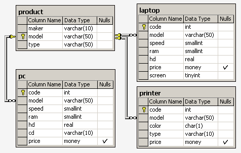
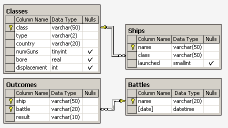

[Ссылка на описание БД](https://sql-ex.ru/help/select13.php#db_1)

**Компьютерная фирма**



---
**Корабли и сражения**



---
**Аэрофлот**


---
**Окраска**


---
---

№ 1
---

**Задача:**

Найдите номер модели, скорость и размер жесткого диска
для всех ПК стоимостью менее 500 дол. Вывести: model,
speed и hd

**Решение:**

```sql
SELECT model, speed, hd 
FROM PC
WHERE price < 500
```

---

№ 2
---

**Задача:**

Найдите производителей принтеров. Вывести: maker

**Решение:**

```sql
SELECT DISTINCT maker 
FROM Product 
WHERE type LIKE('Printer')
```

---


№ 3
---

**Задача:**

Найдите номер модели, объем памяти и размеры экранов 
ПК-блокнотов, цена которых превышает 1000 дол.

**Решение:**

```sql
SELECT model, ram, screen
FROM Laptop
WHERE price > 1000
```

---

№ 4
---

**Задача:**

Найдите все записи таблицы Printer для цветных принтеров.

**Решение:**

```sql
SELECT * 
FROM Printer
WHERE color = 'y'
```

---

№ 5
---

**Задача:**

Найдите номер модели, скорость и размер жесткого диска ПК,
имеющих 12x или 24x CD и цену менее 600 дол.

**Решение:**

```sql
SELECT model, speed, hd
FROM PC
WHERE price < 600 AND cd IN('12x', '24x')
```

---

№ 6
---

**Задача:**

Для каждого производителя, выпускающего ПК-блокноты c 
объёмом жесткого диска не менее 10 Гбайт, найти скорости
таких ПК-блокнотов. Вывод: производитель, скорость.

**Решение:**

```sql
SELECT DISTINCT
    p.maker,
    lp.speed
FROM
    Product AS p INNER JOIN Laptop AS lp ON p.model = lp.model
WHERE
    lp.hd >= 10.0
ORDER BY 
    maker, speed
```

---

№ 7
---

**Задача:**

Найдите номера моделей и цены всех имеющихся в
продаже продуктов (любого типа) производителя 
'B' (латинская буква).

**Решение:**

```sql
SELECT 
    lp.model, lp.price 
FROM 
    Product AS pr 
    INNER JOIN Laptop AS lp ON pr.model = lp.model
WHERE 
    pr.maker = 'B'

UNION

SELECT 
    pt.model, pt.price 
FROM 
    Product AS pr 
    INNER JOIN Printer AS pt ON pr.model = pt.model
WHERE 
    pr.maker = 'B'

UNION

SELECT 
    pc.model, pc.price 
FROM 
    Product AS pr 
    INNER JOIN PC AS pc ON pr.model = pc.model
WHERE
    pr.maker = 'B'
```

---

№ 8
---

**Задача:**

Найдите производителя, выпускающего ПК, 
но не ПК-блокноты.

**Решение:**

```sql
SELECT DISTINCT maker 
FROM Product 
WHERE type = 'PC'
EXCEPT
SELECT DISTINCT maker 
FROM Product 
WHERE type = 'Laptop'
```

---

№ 9
---

**Задача:**

Найдите производителей ПК с процессором 
не менее 450 Мгц. Вывести: Maker

**Решение:**

```sql
SELECT DISTINCT 
                pr.maker 
FROM 
     Product AS pr 
INNER JOIN PC AS pc ON pr.model = pc.model
WHERE 
     pc.speed >= 450
```

---

№ 10
---

**Задача:**

Найдите модели принтеров, имеющих 
самую высокую цену. Вывести: model, price

**Решение:**

```sql
SELECT 
    model, price 
FROM 
    Printer 
WHERE 
    price = (SELECT MAX(price)
               FROM Printer
            )
```

**Пояснение:**

Если сделать так:

```sql
SELECT 
    model, max(price)
FROM 
    Printer 
GROUP BY 
    model
```

То получим записи с самыми высокими ценами внутри каждой из групп,
но чтобы получить только те записи, что соответствуют самой высокой
цене, потребуется сделать подзапрос.

---


№ 11
---

**Задача:**

Найдите среднюю скорость ПК.

**Решение:**

```sql
SELECT 
       avg(speed)
FROM 
    PC AS pc
```

---

№ 12
---

**Задача:**

Найдите среднюю скорость ПК-блокнотов, цена которых 
превышает 1000 дол.

**Решение:**

```sql
SELECT 
       AVG(speed) 
FROM 
     Laptop
WHERE 
      price > 1000
```

---

№ 13
---

**Задача:**

Найдите среднюю скорость ПК, выпущенных производителем A.

**Решение:**

```sql
SELECT 
       AVG(pc.speed)
FROM 
     PC AS pc INNER JOIN Product AS pr ON pc.model = pr.model 
WHERE 
      pr.maker = 'A'
```

---

№ 14
---

**Задача:**

Найдите класс, имя и страну для кораблей из таблицы Ships, 
имеющих не менее 10 орудий.

**Решение:**

```sql
SELECT
    sh.class, sh.name, cs.country
FROM Ships AS sh INNER JOIN Classes AS cs ON sh.class = cs.class
WHERE cs.numGuns >=10
```

---

№ 15 
---

**Задача:** 

Найдите размеры жестких дисков, совпадающих у двух и 
более PC. Вывести: HD

**Решение:**

```sql
SELECT hd
FROM PC as pc 
GROUP BY hd
HAVING count(hd) >= 2
```
В таблице PC есть параметры компьютера, один из которых это 
hd (размер жесткого диска), если получить все параметры hd то
получим такой ответ 

    SELECT hd FROM PC ;    

    Все hd         После групировки   После отбора HAVING count(hd) > 2
    10.0            10.0                         10.0
    10.0            14.0                         14.0
    10.0            20.0                         20.0
    14.0            40.0                         5.0
    14.0            5.0                          8.0
    20.0            8.0
    20.0
    40.0
    5.0
    5.0
    8.0
    8.0

---

№ 16
---

**Задача:**

Найдите пары моделей PC, имеющих одинаковые скорость и RAM.
В результате каждая пара указывается только один раз, 
т.е. (i,j), но не (j,i), Порядок вывода: модель с большим номером,
модель с меньшим номером, скорость и RAM.

**Решение:**

```sql
SELECT DISTINCT 
    pc1.model, pc2.model, pc1.speed, pc1.ram 
FROM PC AS pc1, PC AS pc2
WHERE
    pc1.model != pc2.model 
    AND
    pc1.model > pc2.model 
    AND
    pc1.ram = pc2.ram 
    AND 
    pc1.speed = pc2.speed
```

---


№ ?
---

**Задача:**


**Решение:**

```sql

```

---
