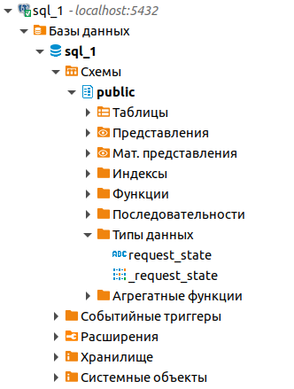

Перечисления ENUM
---

Postgres имеет специальный тип данных `enum` его называют перечислением, этот тип 
данных предоставляет набор констант.

Создадим новое перечисление с 3 элементами:
```sql
CREATE TYPE request_state AS ENUM ('created', 'approved', 'finisshed');
```

После создания мы можем увидеть появившееся перечисление в разделе `Типы данных` для
этой БД.



Теперь мы можем указывать это пересечение как тип данных при создании столбца в таблице,
это накладывает ограничение на столбец в таблице, разрешая ему иметь только один из 
элементов, что присутствует в пересечении.

```sql
CREATE table en1(
    id serial primary key,
    title varchar(30),
    status request_state
);
```

При добавлении новых данных, мы должны указывать для поля `status` только один из
допустимых пересечением типов:

```sql
insert into en1(title, status) values ('Request 1', 'created');
```
