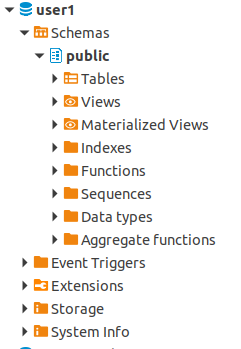

Последовательности `SEQUENCE`
---
Сущность последовательностей можно сравнить с итераторами в `python`, это
счетчик чисел, который увеличивается при каждом обращении к нему на 1, и не
возвращается к прошлому значению.

Функции последовательностей:

1. `nextval('<название последовательности>')` - при каждом обращении увеличивает
счетчик последовательности на 1.
2. `currval('<название последовательности>')` - всегда получает текущее значение 
последовательности.

```sql
-- создание последовательности с названием `seq_1`
CREATE SEQUENCE seq_1; 

-- автоинкрементация последовательности на 1 еденицу
SELECT nextval('seq_1');

-- получение текущего значения последовательности
SELECT currval('seq_1');
```

Все последовательности хранятся в системной таблице `information_schema."sequences"`
получим информацию о созданной последовательности:

```sql
SELECT * 
FROM information_schema."sequences"
WHERE sequence_name = 'seq_1';
```

Что мы увидим, место хранения последовательности, и ее тип данных, по дефолту 
это `bigint`, тут же есть описание начального и минимально возможного значения,
значение на которое увеличивается последовательность и максимальное значение.

| sequence_catalog | sequence_schema | sequence_name | data_type |
|------------------|:---------------:|--------------:|----------:|
| user1            |     public      |         seq_1 |    bigint |

| start_value | minimum_value |       maximum_value |   increment | cycle_option |
|-------------|:-------------:|--------------------:|------------:|-------------:|
| 1           |       1       | 9223372036854775807 |           1 |           NO |

В структуре данных мы можем увидеть как все последовательности хранятся в 
каталоге `Sequences`



---
Таблицы и последовательности
---

Для понимания, что такое последовательности, давайте начнем с самого начала,
создадим таблицу, в самой ее базовой форме, без каких либо последовательностей,
первичных ключей и автоинкрементаций, в этой таблице есть только столбцы и 
ничего более. 

```sql
-- Создадим таблицу
BEGIN;

CREATE TABLE "table_1" 
(
 "id" integer NULL, 
 "name" varchar(255) NULL, 
 "title" varchar(255) NULL, 
 "count" integer Null
);

COMMIT;

-- Внесем данные
INSERT INTO public.table_1 (id, "name", title, count) VALUES(1, '11', '111', 1111);
INSERT INTO public.table_1 (id, "name", title, count) VALUES(2, '22', '222', 2222);
INSERT INTO public.table_1 (id, "name", title, count) VALUES(1, '11', '111', 1111);
INSERT INTO public.table_1 ("name", title, count) VALUES('33', '333', 3333);
```

Получившаяся таблица:

| id   | name | title | count |
|------|:----:|------:|------:|
| 1    |  11  |   111 |   111 |
| 2    |  22  |   222 |   222 |
| 1    |  11  |   111 |   111 |
| NULL |  33  |   333 |  3333 |

Как можем видеть, это просто таблица с 4 столбцами, по скольку для таблицы не 
определен ни `AUTOINCREMENT` ни `PRIMARY KEY` то записи могут полностью 
дублироваться, из-за чего нельзя обеспечить уникальность каждой конкретной строки,
так и в столбце `id` могут быть пустые значения, по скольку поле не 
автоинкрементируется, и значению в нем просто неоткуда появиться.

---

В самом начале мы уже создали последовательность с названием `sqe_1` которая 
по дефолту создается с типом `bigint`, несколько раз вызвав команду 
`SELECT nextval('seq_1')` мы увеличили счетчик последовательности до числа `18`.
Теперь создадим новую таблицу


```sql
BEGIN;
CREATE TABLE "table_2" 
(
 "id" bigint NOT NULL PRIMARY KEY DEFAULT (nextval('seq_1')), 
 "name" varchar(255) NULL UNIQUE
);
COMMIT;

INSERT INTO table_2 (name) VALUES('hello world 1');
INSERT INTO table_2 (name) VALUES('hello world 2');
```
