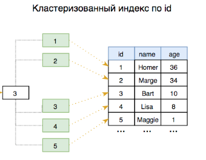

Индексы (методами доступа)
---
---

Индексы это специальные объекты СУБД, которые используются для ускорения
и оптимизации доступа к данным, примеры индексов :
`Hash`, `B-tree`, `GiST`, `SP-GiST`, `GIN` и `RUM`, `BRIN` и `Bloom`.

По сути любая БД может работать и без индексов, и вести поиск нужных данных 
последовательным перебором всех строк в таблице, однако если использовать индексы
они не только помогают ускорить работу, но и помогают поддерживать ограничений 
целостности.

В зависимости от типа индексов, создавая этот индекс, данные могут копироваться
и располагаться определенным образом, для облегчения поиска, а иногда вместо
копии, информация упорядочивается особенным образом по специальному индексу
для оптимизации ее получения.

Индексы бывают 2 типов:

- Кластеризованный индекс - у данных есть специальный индекс, и данные 
объединяются в специальный блок по этому индексу.

- Не кластеризованный индекс - данные хранятся в произвольном порядке, но у 
данных есть специальный индекс, и порядок данных определяется этим индексом.

Помимо этого индекс может использоваться для ограничения уникальных значений в 
таблице, сортировки, группировки и соединения таблиц.

---

Несмотря на множество индексов все они реализуют примерно одну стратегию, все они
устанавливают соответствие между ключом (проиндексированным столбцом `id`) и
строками таблицы к которым эти ключи привязаны.

Взамен ускорения получения данных, индекс требует затрат на свое содержание, при
любой операции над проиндексированными данными такие как вставка, удаление и
обновление, индекс должен быть перестроен, причем в рамках той же транзакции, 
дабы обеспечить безопасность операции, этот механизм называется 
`HOT (Heap-Only Tuples)`

---
Устройство БД
---

`database cluster` - или просто кластер, это одна и более БД, управляемых из под
оной инстанции сервера, когда мы устанавливаем `postgres` мы по сути и получаем 
этот кластер с БД, `postgres` поставляется с 2 заранее предопределенными БД, 
БД `postgres` и `template1`

БД `template1` - это шаблон БД, когда мы создаем новую БД, она наследуется от 
шаблона баз данных `template1`, это возможно по тому что сам по себе `postgres`
является объектно ориентированным, как и все ее типы.


---
Команда `VACUUM`
---
`VACUUM [FULL]` - команда очищения от устарелых данных, когда мы работаем с 
данными, и удаляем их и таблицы, они не удаляются сразу, это требуется для 
реализации конкурентного доступа другим пользователям, данная команда помечает
устаревшие данные как данные которые можно перезаписать.

`VACUUM FULL` - используете если было удалено очень много данных.

`VACUUM ANALYZE` - это комбинация двух разных команд, собирает статистику для
анализа., что поможет помочь планировщику запросов, для выполнения запросов.

Демон `Autovacuum` -  


---
По умолчанию индексы находятся в таблице `pg_am` 

```sql
-- получить список всех типов индексов
SELECT amname FROM pg_am;

-- Результат:
btree
hash
gist
gin
spgist
brin
```

`btree` - называется `сбалансированное дерево` - это дефолтный и самый 
распространенный индекс, именно он создается по умолчанию


---
Первичный ключ (PRIMARY KEY) и B-tree
---

Индекс `B-tree` пригоден для данных которые можно отсортировать.

Индекс `B-tree` основывается на бинарном поиске, если все записи в таблице
будут иметь уникальный номер, то есть `id` и отсортированы по нему, то при поиске
нужного `id` можем использовать алгоритм бинарного поиска, таким образом можно 
ускорить поиск с последовательного перебора `O(n)` до скорости бинарного поиска 
`O(log(n))`, такое решение прекрасно масштабируется ибо бинарный поиск тем 
эффективнее тем больше количество записей.

---

Когда мы создаем таблицу с первичным ключом `PRIMARY KEY`, на него по умолчанию 
и создается кластеризованный индекс, обычно он создается на столбец `id`, так
каждая запись по этому столбцу будет уникальной, и уникально идентифицировать 
каждую запись в таблице

```sql
CREATE TABLE public.report (
    id bigserial NOT NULL,  
    name varchar(255) NOT NULL,
    is_active bool NOT NULL,
    CONSTRAINT report_pkey PRIMARY KEY (id)
);
```



