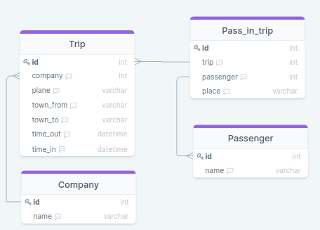
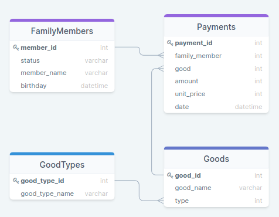
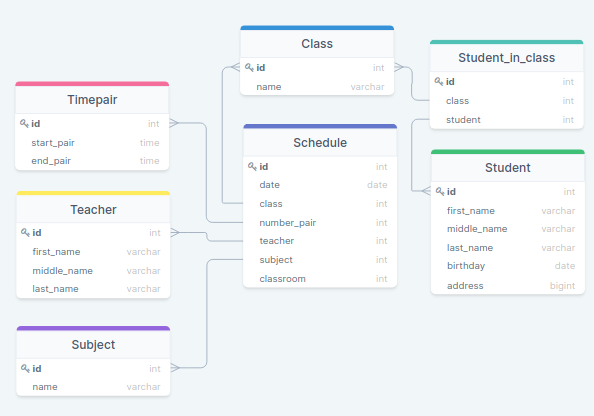

Решение заданий
---
---
**Таблица: Путешествия**



**Таблица: Семейные покупки**



**Таблица: Школа**



---

##№ 1
####Задача: 
Вывести имена всех когда-либо обслуживаемых пассажиров авиакомпаний
####Условие:
Поля в результирующей таблице: name
####Решение:
```sql
SELECT name from Passenger;
```
---


##№ 2
####Задача: 
Вывести названия всеx авиакомпаний
####Условие:
Поля в результирующей таблице: name
####Решение:
```sql
SELECT name FROM Company;
```
---


##№ 3
####Задача:
Вывести все рейсы, совершенные из Москвы
####Условие:
Поля в результирующей таблице: *
####Решение:
```sql
SELECT * FROM Trip 
WHERE town_from = 'Moscow';
```
---


##№ 4
####Задача:
Вывести имена людей, которые заканчиваются на "man"
####Условие:
Поля в результирующей таблице: name
####Решение:
```sql
SELECT name FROM Passenger 
WHERE name LIKE ('%man');
```
Функция LIKE сверяет по паттерну, как регулярное выражение,
спец.символ '%' указывает на любое количество символов. 

---


##№ 5
####Задача:
Вывести количество рейсов, совершенных на TU-134
####Условие:
Поля в результирующей таблице: count
####Решение:
```sql
SELECT COUNT(*) as count  
FROM Trip 
WHERE plane = 'TU-134';  
```
Отсеиваем условием WHERE на нужный тип самолетов, и 
далее просто считаем количество этих самолетов.
---


##№ 6
####Задача:
Какие компании совершали перелеты на Boeing
####Условие:
Поля в результирующей таблице: name
####Решение:
```sql
SELECT DISTINCT 
                cm.name
FROM Company AS cm 
INNER JOIN Trip AS tr ON cm.id = tr.company
WHERE 
      tr.plane = "Boeing"
```
Есть 2 таблицы, с компаниями и путешествиями, соединяем их по
внешнему ключу, получаем те компании из таблицы компании, у
которых в другой таблице тип самолета это "Boeing"
---


##№ 7
####Задача:
Вывести все названия самолётов, на которых можно улететь в Москву (Moscow)
####Условие:
Поля в результирующей таблице: plane
####Решение:
```sql
SELECT DISTINCT  
                plane 
FROM Trip AS tr 
WHERE town_to = 'Moscow'
```
---


##№ 8
####Задача:

####Условие:

####Решение:
```sql

```
---


##№ 9
####Задача:
Какие компании организуют перелеты с Владивостока (Vladivostok)?
####Условие:
Поля в результирующей таблице: name
####Решение:
```sql
SELECT DISTINCT cm.name 
FROM Company AS cm INNER JOIN Trip AS tr 
ON cm.id = tr.company
WHERE town_from = 'Vladivostok';
```
---


##№ 12
####Задача:
Вывести id и количество пассажиров для всех прошедших полётов
####Условие:
Поля в результирующей таблице: trip, count
####Решение:
```sql
SELECT 
    pit.trip as trip, count(pr.id) as count
FROM 
    Pass_in_trip AS pit INNER JOIN Passenger AS pr ON pit.passenger = pr.id
GROUP BY 
    trip
;
```
Это типичный, стандартный пример обычной группировки, есть 2 таблицы связанные
по внешнему ключу, одна путешествий и другая с пассажирами, что на эти 
путешествия зарегистрированы, соединяем таблицы, группируем по путешествиям,
и к каждому из путешествий используем агрегатную функцию count, чтобы
посчитать количество пассажиров, зарегистрированных для каждого из путешествий.
---


##№ 14
####Задача:
В какие города летал Bruce Willis
####Условие:
Поля в результирующей таблице: town_to
####Решение 1:
```sql
SELECT DISTINCT 
    tr.town_to
FROM 
    Trip AS tr 
    INNER JOIN Pass_in_trip AS pit ON tr.id = pit.trip 
    INNER JOIN Passenger AS pa ON  pit.passenger = pa.id 
WHERE 
    pa.name = 'Bruce Willis';
```
Из-за того что имена пассажиров лежат в одной таблице, а города 
для полета в другой, и связаны между собой они через связующую таблицу,
нам приходится делать 2 связки, чтобы соединить 3 таблицы.

####Решение 2:
```sql
SELECT town_to 
FROM Trip 
WHERE id IN(
    SELECT trip 
    FROM  Pass_in_trip 
    WHERE Passenger IN(
        SELECT id 
        FROM Passenger 
        WHERE name = 'Bruce Willis'
    ) 
) 
```
Это второй способ решения данной задачи, она основана на 2 
под запросах, суть ее решение следующая.

Первый запрос:
```sql
    SELECT id from Passenger WHERE name = 'Bruce Willis'
    -- Получаем
    --        1 
    --       31
``` 

Второй запрос:
```sql
    SELECT * FROM  Pass_in_trip 
    WHERE Passenger IN(1,31) 
    -- Получаем
    -- 1	1100	1	1a
    -- 3	1123	1	4c
    -- 7	1181	1	1a
```

Внешний запрос:
```sql
SELECT * FROM Trip 
WHERE id IN(1100, 1123, 1181) 
-- Получаем
-- 1100	 4	Boeing	Rostov	Paris	   
-- 1123	 3	TU-154	Rostov	Vladivostok
-- 1181	 1	TU-134	Rostov	Moscow
```
---

##№ 15
####Задача:
Во сколько Стив Мартин (Steve Martin) прилетел в Лондон (London)
####Условие:
Поля в результирующей таблице: time_in
####Решение:
Это типичный пример обыкновенного джоина.
```sql
SELECT 
       time_in 
FROM 
     Trip as tr
INNER JOIN Pass_in_trip AS pit ON tr.id = pit.trip
INNER JOIN Passenger AS pa ON pit.passenger = pa.id
WHERE 
      pa.name = "Steve Martin" AND tr.town_to = "London";
```
---

##№ 19
####Задача:
Определить, кто из членов семьи покупал картошку (potato)
####Условие:
Поля в результирующей таблице: status
####Решение:
Это типичный пример обыкновенного, просто связываем таблицы и отсеиваем
на предмет товара "Картошка".
```sql
SELECT DISTINCT 
                fm.status
FROM 
     FamilyMembers AS fm 
INNER JOIN Payments AS pay ON fm.member_id = pay.family_member
INNER JOIN Goods AS go ON pay.good = go.good_id
WHERE 
    go.good_name = "potato";
```
---

##№ 22
####Задача:
Найти имена всех матерей (mother)
####Условие:
Поля в результирующей таблице: member_name
####Решение:
```sql
SELECT 
       member_name
FROM 
     FamilyMembers AS fm 
WHERE 
      status = "mother";
```
---

##№ 28
####Задача:
Сколько рейсов совершили авиакомпании с Ростова 
(Rostov) в Москву (Moscow) ?
####Условие:
Поля в результирующей таблице: count(*)
####Решение:
```sql
SELECT count(*) AS count
FROM 
    Trip AS tr 
WHERE 
    town_from = "Rostov" AND town_to = "Moscow";
```
---


##№ 34
####Задача:
Сколько всего 10-ых классов
####Условие:
Поля в результирующей таблице: count
####Решение:
```sql
SELECT count(name) as count 
FROM class 
WHERE name LIKE("10%")
;
```
---

##№ 36
####Задача:
Выведите информацию об обучающихся живущих на улице 
Пушкина (ul. Pushkina)?
####Условие:
Поля в результирующей таблице: *
####Решение:
```sql
SELECT *
FROM Student
WHERE address LIKE("%ul. Pushkina%");
```
---

##№ 38
####Задача:
Сколько Анн (Anna) учится в школе ?
####Условие:
Поля в результирующей таблице: count
####Решение:
```sql
SELECT count(*) as count 
FROM Student
WHERE first_name = "Anna";
```
---


##№ 39
####Задача:
Сколько обучающихся в 10 B классе ?
####Условие:
Поля в результирующей таблице: count
####Решение:
```sql
SELECT 
       count(*) as count 
FROM 
    Student_in_class AS sic 
    INNER JOIN Class AS cs ON sic.class = cs.id 
WHERE 
    cs.name LIKE("10 B");
```
---


##№ ?
####Задача:

####Условие:

####Решение:
```sql

```
---