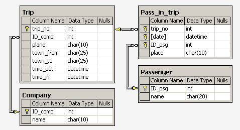
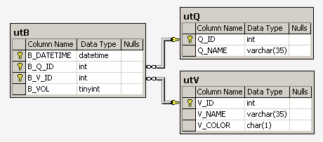

[БД для работы](https://sql-ex.ru/help/select13.php#db_1)

**Компьютерная фирма**


---
**Корабли и сражения**


---
**Аэрофлот**


---
**Окраска**

---

##№ 1

####Задача:
Найдите номер модели, скорость и размер жесткого диска
для всех ПК стоимостью менее 500 дол. Вывести: model,
speed и hd

####Решение:
```sql
SELECT model, speed, hd 
FROM PC
WHERE price < 500
```

***

##№ 2
####Задача:
Найдите производителей принтеров. Вывести: maker
####Решение:
```sql
SELECT DISTINCT maker 
FROM Product 
WHERE type LIKE('Printer')
```

***


##№ 3
####Задача:
Найдите номер модели, объем памяти и размеры экранов 
ПК-блокнотов, цена которых превышает 1000 дол.
####Решение:
```sql
SELECT model, ram, screen
FROM Laptop
WHERE price > 1000
```

***

##№ 4
####Задача:
Найдите все записи таблицы Printer для цветных принтеров.
####Решение:
```sql
SELECT * 
FROM Printer
WHERE color = 'y'
```

***

##№ 5
####Задача:
Найдите номер модели, скорость и размер жесткого диска ПК,
имеющих 12x или 24x CD и цену менее 600 дол.
####Решение:
```sql
SELECT model, speed, hd
FROM PC
WHERE price < 600 AND cd IN('12x', '24x')
```

***

##№ 6
####Задача:
Для каждого производителя, выпускающего ПК-блокноты c 
объёмом жесткого диска не менее 10 Гбайт, найти скорости
таких ПК-блокнотов. Вывод: производитель, скорость.

####Решение:
```sql
SELECT DISTINCT
    p.maker,
    lp.speed
FROM
    Product AS p INNER JOIN Laptop AS lp ON p.model = lp.model
WHERE
    lp.hd >= 10.0
ORDER BY 
    maker, speed
```

***

##№ 7
####Задача:
Найдите номера моделей и цены всех имеющихся в
продаже продуктов (любого типа) производителя 
'B' (латинская буква).
####Решение:
```sql
SELECT 
    lp.model, lp.price 
FROM 
    Product AS pr 
    INNER JOIN Laptop AS lp ON pr.model = lp.model
WHERE 
    pr.maker = 'B'

UNION

SELECT 
    pt.model, pt.price 
FROM 
    Product AS pr 
    INNER JOIN Printer AS pt ON pr.model = pt.model
WHERE 
    pr.maker = 'B'

UNION

SELECT 
    pc.model, pc.price 
FROM 
    Product AS pr 
    INNER JOIN PC AS pc ON pr.model = pc.model
WHERE
    pr.maker = 'B'
```


***

##№ 8
####Задача:
Найдите производителя, выпускающего ПК, 
но не ПК-блокноты.
####Решение:
```sql
SELECT DISTINCT maker 
FROM Product 
WHERE type = 'PC'
EXCEPT
SELECT DISTINCT maker 
FROM Product 
WHERE type = 'Laptop'

```

***

##№ 9
####Задача:
Найдите производителей ПК с процессором 
не менее 450 Мгц. Вывести: Maker
####Решение:
```sql
SELECT DISTINCT 
                pr.maker 
FROM 
     Product AS pr 
INNER JOIN PC AS pc ON pr.model = pc.model
WHERE 
     pc.speed >= 450
```

***

##№ 10
####Задача:
Найдите модели принтеров, имеющих 
самую высокую цену. Вывести: model, price
####Решение:
```sql
SELECT 
    model, price 
FROM 
    Printer 
WHERE 
    price = (SELECT MAX(price)
               FROM Printer
            )
```
####Пояснение:
Если сделать так:
```sql
SELECT 
    model, max(price)
FROM 
    Printer 
GROUP BY 
    model
```
То получим записи с самыми высокими ценами в 
нутри каждой из групп, но чтобы получить только те
записи что соот-ют самой высокой цене, потребуется 
сделать подзапрос.
***


##№ 11
####Задача:
Найдите среднюю скорость ПК.
####Решение:
```sql
SELECT 
       avg(speed)
FROM 
    PC AS pc
```

***


##№ ?
####Задача:
####Решение:
```sql

```

***
